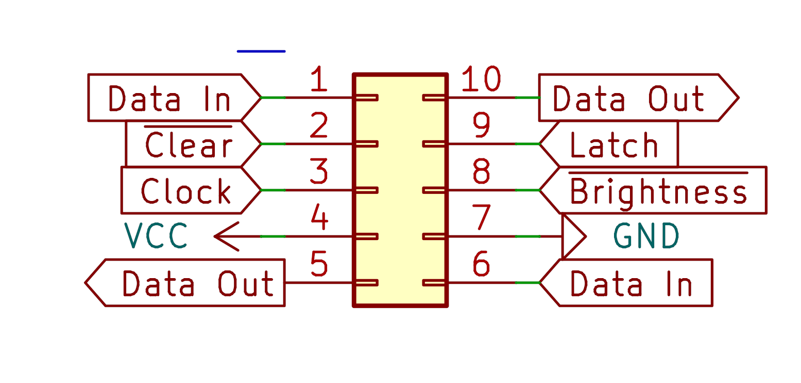

# Retrolite
A retro themed segmented display with a built in driver.

  

## Design Goals
- Chainable
- Easy to use
- Sleek
- Flicker free*
    - Depends on the state and frequency of the brightness control pin.

RetroLite stands as a continuation of my original 2.5 digit display, [InfiDig](https://github.com/CC-Ian/InfiDig-hardware). InfiDig was built around these very same LED Filaments, but required more resources to effectively manage. This is because InfiDig was charlieplexed using the host microcontroller. This caused flickering when chained in lengths of three or more, as seen on my [weather display](https://youtu.be/jOu5g1SzCnQ). 

RetroLite fixes the flicker issue by moving from a charlieplexed design to a direct-drive design. This makes these devices "Set and forget" as opposed to a device which requires a new framebuffer precisely every millisecond. In addition, this makes the display of arbitrary shapes or letters significantly easier to implement. Instead of breaking each shape down into three separate frames, you simply shift in an appropriate 8 bit pattern.

## Connections
It is recommended to connect RetroLite to a free SPI bus, however that is not exclusively necessary. Using your SPI bus will likely provide the highest rate of data throughput (up to a maximum of 100MHz depending on configuration. See [here](https://assets.nexperia.com/documents/data-sheet/74HC_HCT595.pdf)), but it is not strictly necessary, as the driver is a simple 8 bit serial to parallel shift register. It may provide an interesting effect to shift more slowly, fading the display into the next string you wish to display.

### Pinout

### Pin Numbering

## Limitations
RetroLite maintains the same limitations as general seven segment displays, being unable to unambiguously display certain letters due to their shapes. See this [article](https://en.wikipedia.org/wiki/Seven-segment_display_character_representations) covering characters and their seven segment display representations.